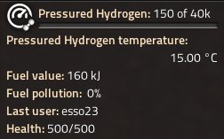

# pY Pollution & Energy

Main goals of the mod:
- Add pollution values to all entities in the game (assemblers, miners) that previously didn't have them.
- Playing with all of the Pyanodon's mods takes much longer, and on default vanilla settings it is pretty much impossible to play with biters enabled. We added some recommended map presets that play well with our pollution settings.
- Voiding of some fluids and gases should not generate pollution (Oxygen, Water, Hydrogen etc.).
- Raw fuels like Wood, Coal and Crude Oil now pollute more while processed fuels pollute less. This should motivate players to build advanced processing chains.
- Combustion Turbine rebalancing.
- Hydrogen rebalancing - It now takes more energy to produce Hydrogen than it provides but Hydrogen now has 0% pollution modifier (like with real Hydrogen).
- Pollution-absorbing buildings now absorb more pollution when used with advanced recipes.

## Dependencies

This mod is made to be played with entire pY Suite (except for pY Alien Life), so all these mods are required:
- Pyanodons Raw Ores
- Pyanodons Fusion Energy
- Pyanodons Coal Processing
- Pyanodons HighTech
- Pyanodons Petroleum Handling
- Pyanodons Industry

Note: We have no plans to support pY Alien Life right now. pyAL introduces an entirely new level of difficulty which will make you go insane and we are not ready for such levels of pain (yet :).

## Diving deeper

### Map presets

There are 3 map presets available:
- **Easy** - For newbies and people who break under pressure (:D)
    - Pollution factor: 2
    - Destroy factor: 50
    - Time factor: 0
    - Starting area: 133%
- **Default**
    - Pollution factor: 3
    - Destroy factor: 75
    - Time factor: 5
    - Starting area: 133%
- **Hard** - For those who like some challenge or for pY professionals, feel free to add more if you feel like it
    - Pollution factor: 4
    - Destroy factor: 100
    - Time factor: 10
    - Starting area: 133%

### Combustion Turbine

This has been balanced in a way that it's slightly worse than burning Coal at MK01 and then gets much better at higher MKs.
Basically, Combustion Turbine MK01 produces more energy in comparison to boilers but at a cost of higher pollution.  
We also changed some Combustion Mixture recipes, some were not viable and some were way too strong. Combustion Mixture recipe effectiveness still varies though.

### Fuels

Example:
- **Wood** - 125% pollution
- **Coal** - 105% pollution
- **Coke** - 85% pollution

As you process further, you get less pollution on your fuels (this is not a general rule, we left some of them untouched at 100% pollution).  
We also made Fuel Rods viable, MK01 starts at 75% pollution and goes all the way down to 49% at MK05.
Some liquid fuels have had their energy capacity reduced slightly.

### Hydrogen

Until now you could use Hydrogen as an easy source of fuel, but that is no more. It is known fact that you need more energy to separate hydrogen from oxygen than the hydrogen provides (around 170 MJ to produce 1kg of Hydrogen which has 120 - 140 MJ of energy).  
Also, 1kg of Hydrogen in gas state has ~12m3 so prepare your largest fluid tanks :)  
One unit of hydrogen now has 15kJ (this is calculated from Electrolyzer MK01, so on higher MKs you can be energy-positive) down from 400kJ, but using Hydrogen no longer generates ANY pollution.  
You can also use Pressured Hydrogen as fuel if you want to save some space (you also get some extra energy value when you do this).

### Pollution-absorbing buildings

Example:
Botanical Nursery MK01 now has base pollution of -10/m
- Basic recipe for Log takes 80 seconds and has pollution modifier 100%
- Making Logs using water takes 60 seconds, but has pollution modifier 116.667% - now the building has pollution -11.67/m
- The best recipe with Fertilizer takes 10 seconds and has 450% pollution modifier - now the building has pollution -45/m

This works for the following buildings:
- Botanical Nursery
- Moondrop Greenhouse
- Kicalk Plantation
- Ulric Corral
- Mukmoux Pasture
- Guar Gum Plantation

Why? Previously you were basically penalized for using more effective recipes, since you needed less buildings, absorbing less pollution.

Note: Amount of products is also taken into consideration.

# Special thanks

To [Pyanodon](https://github.com/pyanodon) for creating this great mod [suite](https://mods.factorio.com/user/pyanodon).  
You can support his work at his [Patreon](https://www.patreon.com/pyanodon/posts).
